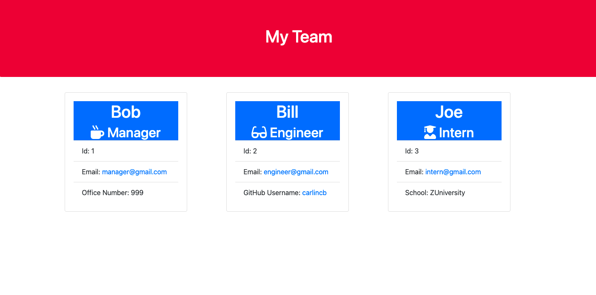
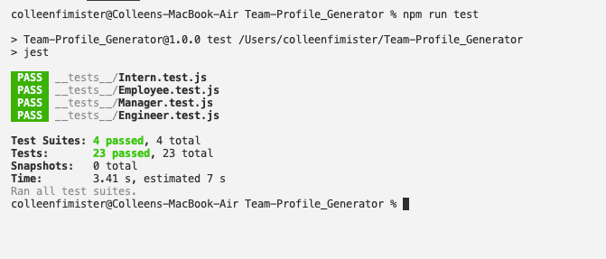

# Team-Profile_Generator

## Description

A Node.js command-line application that takes in information about employees then generates an HTML webpage that displays summaries for each person. Includes example unit tests for the code.

**Tools & Skills Used**<br>
Node.js, Jest, Classes, and Function and File Dependency.

## User Story

```md
AS A manager
I WANT to generate a webpage that displays my team's basic info
SO THAT I have quick access to their emails and GitHub profiles
```

## Acceptance Criteria

```md
GIVEN a command-line application that accepts user input
WHEN I am prompted for my team members and their information
THEN an HTML file is generated that displays a nicely formatted team roster based on user input
WHEN I click on an email address in the HTML
THEN my default email program opens and populates the TO field of the email with the address
WHEN I click on the GitHub username
THEN that GitHub profile opens in a new tab
WHEN I start the application
THEN I am prompted to enter the team manager’s name, employee ID, email address, and office number
WHEN I enter the team manager’s name, employee ID, email address, and office number
THEN I am presented with a menu with the option to add an engineer or an intern or to finish building my team
WHEN I select the engineer option
THEN I am prompted to enter the engineer’s name, ID, email, and GitHub username, and I am taken back to the menu
WHEN I select the intern option
THEN I am prompted to enter the intern’s name, ID, email, and school, and I am taken back to the menu
WHEN I decide to finish building my team
THEN I exit the application, and the HTML is generated
```

## Table of Contents

- [Installation](#installation)
- [Usage](#usage)
- [Credits](#credits)
- [License](#license)
- [Contributing](#contributing)
- [Tests](#tests)
- [Links](#links)
- [Questions](#questions)

## Installation

Here are some guidelines to help you get started:

- [Fork the Repo](https://docs.github.com/en/get-started/quickstart/fork-a-repo)

```
git clone https://github.com/carlincb/Team-Profile_Generator
```

- Create a `.gitignore` file and include `node_modules/` and `.DS_Store/` so that your `node_modules` directory isn't tracked or uploaded to GitHub. Be sure to create your `.gitignore` file before installing any npm dependencies.

- Your application should use [Jest](https://www.npmjs.com/package/jest) for running the unit tests and [Inquirer](https://www.npmjs.com/package/inquirer) for collecting input from the user. These are included as dependencies and should be installed by running the following command in the current working directory for this application:

```
npm install
```

- The application will be invoked by using the following command:

```bash
node index.js
```

## Usage

This application can be run using the terminal with Node.js.<br/>Please see below for examples of a typical user through my application:

### Screenshot of application:



### Video Links of Usage:

- https://drive.google.com/file/d/1ARYTk8-0bNbT7Btnqq3JxfrnnNWCvbKP/view?usp=sharing
- https://drive.google.com/file/d/1UauDVGV3fh7kcFhptZ0ILUYDec7sFCx3/view?usp=sharing

## Credits

- https://www.npmjs.com/package/inquirer
- https://www.npmjs.com/package/jest
- https://coding-boot-camp.github.io/full-stack/github/professional-readme-guide

## License

[](https://opensource.org/licenses/MIT)<br/>

    MIT License

    Copyright (c) 2021 COLLEEN FIMISTER

    Permission is hereby granted, free of charge, to any person obtaining a copy
    of this software and associated documentation files (the "Software"), to deal
    in the Software without restriction, including without limitation the rights
    to use, copy, modify, merge, publish, distribute, sublicense, and/or sell
    copies of the Software, and to permit persons to whom the Software is
    furnished to do so, subject to the following conditions:

    The above copyright notice and this permission notice shall be included in all
    copies or substantial portions of the Software.

    THE SOFTWARE IS PROVIDED "AS IS", WITHOUT WARRANTY OF ANY KIND, EXPRESS OR
    IMPLIED, INCLUDING BUT NOT LIMITED TO THE WARRANTIES OF MERCHANTABILITY,
    FITNESS FOR A PARTICULAR PURPOSE AND NONINFRINGEMENT. IN NO EVENT SHALL THE
    AUTHORS OR COPYRIGHT HOLDERS BE LIABLE FOR ANY CLAIM, DAMAGES OR OTHER
    LIABILITY, WHETHER IN AN ACTION OF CONTRACT, TORT OR OTHERWISE, ARISING FROM,
    OUT OF OR IN CONNECTION WITH THE SOFTWARE OR THE USE OR OTHER DEALINGS IN THE
    SOFTWARE.

## Contributing

1. [Fork the Repo](https://docs.github.com/en/get-started/quickstart/fork-a-repo)

2. Create a branch:

```
git checkout -b yourname-branch
```

3. Commit changes:

```
git commit -m 'Your changes here'
```

4. Push to the branch:

```
git push origin yourname-branch
```

5. Submit a pull request and wait for it to be approved or denied.

## Tests

Tests completed using [Jest](https://www.npmjs.com/package/jest) by using the following command in the terminal of Team Profile Generator's directory:

```bash
npm run test
```

### Example of Passed Tests:



## Links

[Sample Page Live Link](https://carlincb.github.io/Team-Profile_Generator/)

[GitHub Link](https://github.com/carlincb/Team-Profile_Generator)

## Questions

If you have questions, please contact me at carlin.colleen@gmail.com or find me at https://github.com/carlincb.
